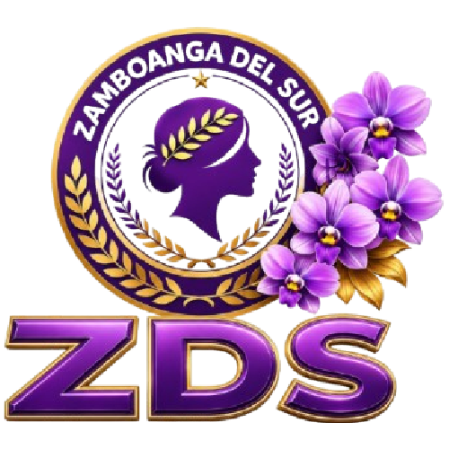

# ZDS KALIPI-RIC Women Federation, Inc.
## Women's Profiling System — CY 2026



A modern, responsive, full-stack web application for profiling, managing, and analyzing member records of the **Zamboanga del Sur KALIPI-RIC Women Federation, Inc.** Built according to official government profiling form standards (CY 2026).

---

## 🌟 Key Features

- **🎨 Modern Glassmorphic Design & Palette**: Inspired by the official federation logo featuring Royal Purple, Gold, and Orchid accents with smooth dark/light mode toggle.
- **🏛️ Barangay Association Header Management**: Manage municipality, barangay name, association title, president/leader, contact info, and DOLE registration #.
- **🎴 Dual Interactive View Modes**:
  - **Cards Grid View**: Elevated 3D cards with micro-animations, position badges (Leader, Officer, Member), civil status pills, and hover quick-action overlays.
  - **Data Table View**: Replicates the official Excel spreadsheet template columns (`No.`, `Name of Woman`, `Age`, `Civil Status`, `Occupation`, `Position`, `Contact Number`, `Remarks`, `Actions`).
- **🔍 Real-Time Search & Multi-Filters**: Instant query matching by name, position, occupation, remarks, and contact number. Filter by Civil Status and Association Position.
- **📊 KPI Dashboard Analytics**: Live dynamic statistics tracking Total Profiled Members, Officers, Solo Parents Advocates, and Average Age.
- **⚡ Full CRUD Operations**: Create, read detailed profile sheets, update, and delete woman records seamlessly.
- **💾 Live MySQL Database + Offline Fallback**: Synchronizes via PHP REST API (`api.php`) directly to MySQL (`zds_kalipi_db`) with automatic browser `localStorage` fallback.
- **📄 Export & Official Printing**:
  - Export dataset to CSV (Excel compatible) or JSON.
  - Formal print module styled directly after official form layouts with signature sections.

---

## 📁 File Structure

```text
d:\Server\www\projects\zds-kalipi\
├── index.html            # Main Single Page Application UI
├── config.php            # Production Database Configuration
├── api.php               # PHP PDO REST API (MySQL CRUD operations)
├── schema.sql            # Database schema DDL & initial seed dataset
├── css\
│   └── style.css         # Glassmorphism design tokens, cards/table, print styles
├── js\
│   ├── app.js            # Core logic engine, state manager, search/filter pipeline
│   └── sample-data.js    # Pre-populated ZDS sample dataset & municipality lists
└── images\
    └── logo.jpg          # Official ZDS KALIPI Federation Logo
```

---

## 🗄️ Database Setup

### 1. Requirements
- MySQL 5.7+ / MariaDB 10.3+ / PHP 7.4+

### 2. Schema Structure
- `barangay_associations`: Header details (Municipality, Barangay, Association Name, Leader, Contact No, DOLE Reg #).
- `women_profiles`: Individual member profile records linked via Foreign Key.

### 3. Import Command
Run in MySQL command line or phpMyAdmin:
```sql
SOURCE schema.sql;
```

---

## 🚀 Installation & Deployment Guide

### Local Development (WampServer / XAMPP / LAMP)
1. Copy project folder to your server root (e.g. `d:/Server/www/projects/zds-kalipi`).
2. Update database credentials in `config.php`:
   ```php
   define('DB_HOST', 'YOUR_DB_HOST');
   define('DB_NAME', 'YOUR_DB_NAME');
   define('DB_USER', 'YOUR_DB_USER');
   define('DB_PASS', 'YOUR_DB_PASS');
   ```
3. Open `http://localhost/projects/zds-kalipi/` or start a local PHP/HTTP server.

### Production Web Server Deployment (cPanel / VPS)
1. Upload `index.html`, `config.php`, `api.php`, `css/`, `js/`, and `images/` to your server `public_html/`.
2. Create a MySQL Database in cPanel / phpMyAdmin.
3. Import `schema.sql` into your production database.
4. Update `config.php` with your live hosting database name, user, and password.

---

## 📜 License & Accreditation
Developed for **Zamboanga del Sur KALIPI-RIC Women Federation, Inc.** &bull; CY 2026.
For inquires: https://mcjim-server.com